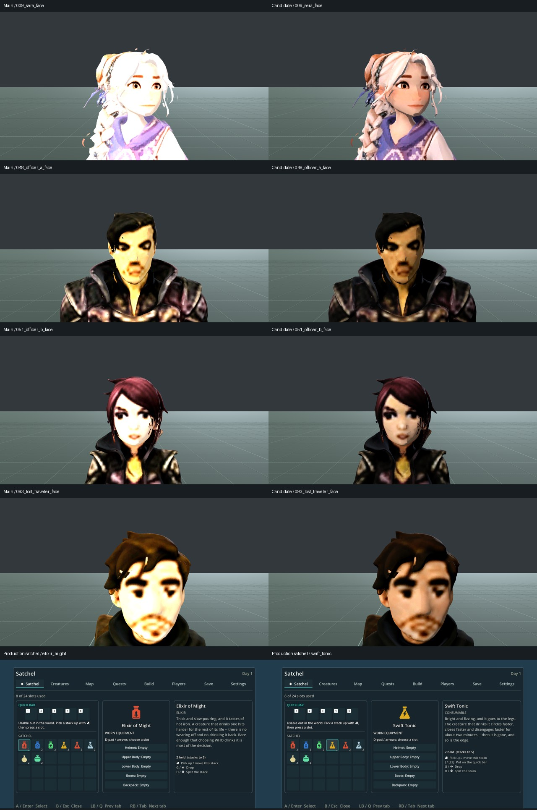

# Cast shading and stat-draught identity

X04 / ART_DIRECTION §§1,5,7 / ACCEPTANCE §4. Baseline main
`025a09d9d2b602e32cfec864c1a93912fd3b40f9`; isolated Codex branch
`tb/x04-cross-game-visual-sweep`, PR #331. Claude owns integration and merge.
This is a bounded repair, not whole-game visual acceptance.
Implementation: `f00685329` (including icons from `5cd397f91`). A final fetch
found main `f7c9a11bb`; its intervening Tidewake return-cadence changes do not
overlap this implementation. The captures remain explicitly based on `025a09d9d`.

## Fresh coverage

Native Windows Godot 4.7 `5b4e0cb0f`, Compatibility, GTX 1060 3 GB, driver
560.94. Requested 1920×1080; subsequent inspection of the raw survey PNGs confirms
**1920×1061**, because Windows constrained the startup client area. The survey
remains diagnostic evidence, not satisfaction of the exact 1080p requirement.
Existing `tools/capture_visual_audit.gd`, without `--fast`:

- Complete roster: 183 frames, zero skipped, including 57 species in front,
  rear and 45%-attack poses plus lineups. Neutral stage; attack-floor failures
  still need actual-combat confirmation before animation changes.
- Complete cast: 128 frames, zero skipped, including production-config bodies,
  named/rank variants, portraits and lineups. Same neutral stage before/after.
- Region sample: Meadows 6, Cloudreach 9, Stormwood 6, Tidewake 9 frames. Existing
  production camera and hand-checked stands; clocks, progression and companions
  posed by the installed audit fixture. These are samples, not complete routes.
  Shellwatch and Veilfall framings do not adequately expose their locations and
  cannot establish those landmarks' acceptance.

Raw local evidence: `shots/cross-game-main-025a09d9d/`; individual screenshots
and generated raw sheets are not committed. The baseline reveals repeated cast
face blowout, creature stage-attack clipping, duplicated rank silhouettes and
material inconsistency. Meadowhart's repaired candidate is absent from this
main, so PR #318 was reopened after its ownership-based closure was verified.

## Changes

Twenty-four later cast bodies retain an exporter artifact: emissiveFactor
`[1,1,1]` and an emissive texture referencing the same image as their diffuse
atlas. Trainer does not; Craftsperson already opts out. **Twenty-two** now
explicitly disable this full-body channel. Captain A/B remain unchanged: the
first candidate exposed an excessive existing whole-body tint in Field, Ridge
and Riverwatch. Preserving their owner-exempt palette requires a separate
material-region repair, not silently neutralizing that tint. Albedo, palettes, meshes,
animation and world lighting are untouched.

The opt-out clears the imported emissive texture on a duplicated body material.
An authored rank floor can still enable its small constant additive light, but
cannot accidentally restore the rejected diffuse atlas. The floor value now
participates in the material cache identity so ranked/unranked copies, or
different floor strengths, cannot acquire one another's material.

Three permanent elixirs and three temporary tonics previously displayed the
same small-potion icon. The existing code-authored family now uses a sealed
bottle for permanent elixirs and a broad flask for temporary tonics, with
effect cutouts. Existing potion icons remain. Only six icon paths and two stale
comments change in item data; effects, quantities and world pickups do not.

## Verification

- `tests/test_craftsperson_material_contract.gd`: **4 tests, 54 assertions,
  zero failures**. Actual imported representatives, unchanged albedo, source
  preservation, opt-out/default separation, authored floor and cache identity.
- Editor import, complete 128-frame initial candidate cast capture and two production
  satchel captures exit zero without script/shader errors. Satchel fixture
  seeds eight item stacks against a bare background; it proves real UI texture
  consumption, not acquisition, consumption or gameplay progression.
- Independent `dock_code_review` finds no source blocker and independently
  verifies all 24 same-image emissive artifacts; two config opt-outs were then
  removed after visual review identified the captain regression. No broader test-suite or
  performance claim.
- Independent image-only `creature_visual_judge` passes six-icon identity at
  32/64 px in colour and grayscale within the established icon family.
- The same judge finds substantial cast improvements and an unchanged trainer
  control, but rejects the initial captain treatment. The final scope excludes
  both captain models rather than claiming their source-paint defects are fixed.
- Final narrowed capture: 31 frames, zero skipped, covering the trainer control,
  Sera, both officers, Lost Traveler, raw Captain A/B and all three named captains.
  Independent image-only review: **scoped PASS**. Captains retain baseline
  appearance, the other reviewed faces retain their shading gains, and both
  production satchel views preserve icon, selection and stack-count readability.
  Raw final frames: `shots/cross-game-cast-final/cast/`; UI: `shots/stat-draught-ui/`.
  `shore_portal_review` independently confirms no source blocker in this final
  narrowing. Whole-game Bars A/B and captain face quality remain open.

## Remaining visual scope

Removing self-light restores shading; it cannot restore facial detail absent
from source paint, repair ragged hair geometry, change duplicated rank bodies,
or prove ordinary-night/world dialogue quality. Creature attack deformation,
landmark silhouette, roofs, terrain/foliage integration, Tether apparatus,
pickup world models and full regional routes remain in the visual scope.
Whole-game Bars A/B remain open. First Shore's further wave iteration remains
parked on draft PR #329 rather than consuming this cross-game work.
