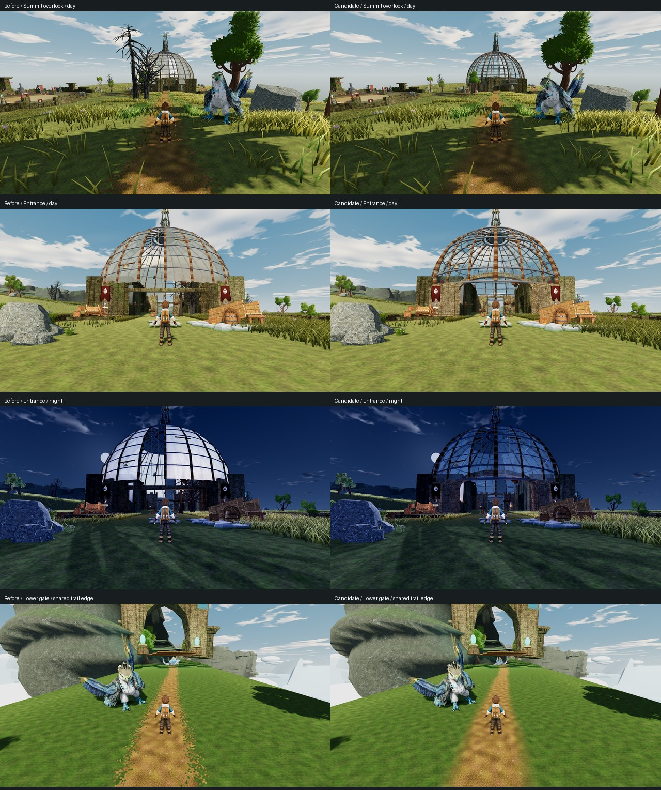
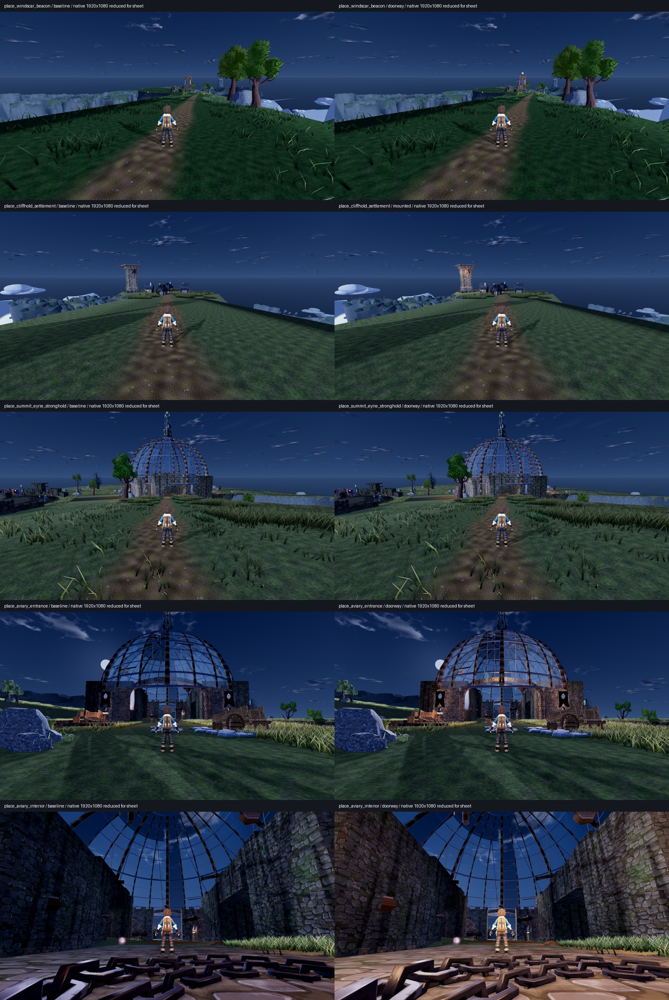

# Cloudreach aviary architecture and trail transitions

X04 / F08 / ART_DIRECTION §§3,4,7 / ACCEPTANCE §4. Isolated branch
`tb/x04-cloudreach-aviary`, PR #338, implementation `ed849997f`, based on main
`51d6dc44e`. Claude owns integration and merge. Whole chapter and whole-game
Bars A/B remain open.

## Observed defects and repair

Native production views show rectangular entrance lintels, a repetitive thin
dome lattice, lanterns placed from jamb centres, decorative trees intersecting
the inhabited footprint and entrance sightline, and near-opaque cream panels
that form a bright white shell at night. Cloudreach trail edges also reveal
square dirt fragments from the shader's fixed 5.6 cm coverage grid.

The candidate gives the four entries curved stone arch frames, articulates
the piers and crown, and separates eight main ribs from sixteen secondary
ribs. The original pier boxes remain hidden as the production footing sampler's
geometry witnesses. All twenty original colliders, route clearances, footprint,
oculus and pylon anchor remain unchanged.

Four installed Quaternius wall lanterns replace the floating post/cube fixtures.
Their metal housings stay opaque; small inset cores and non-shadowing warm
lights supply illumination. The aviary uses the existing Quaternius masonry
textures with its own weathering parameters; surrounding route wings and
Team Tether palettes retain their materials. Blue-grey translucent panes
replace the near-opaque cream treatment.

The decorative tree pass omits trees from the aviary footprint and its eastern
overlook approach corridor, after consuming the same random placement values.
Other sites retain their deterministic scatter. No colliders or gameplay trees
are changed. Path dirt now blends into the exact shared wet/dry turf sample
inside the existing coverage envelope; outside it, the crown remains visible.
Route meshes, height offsets and physics are unchanged.

No new source assets or generation: all materials/props derive from the
installed families already documented in ART_DIRECTION. Architecture is
repo-native geometry; the reference board supplies direction only.

## Verification

- Native Windows Godot 4.7 `5b4e0cb0f`, Compatibility/OpenGL 3.3, GTX 1060 3 GB,
  driver 560.94. Requested 1920×1080, but inspection of the raw PNGs confirms
  **1920×1061**: Windows constrained the startup client area. Baseline/candidate
  rasters match, so the bounded comparison remains useful; this does not meet the
  exact 1080p capture requirement. These are desktop captures, not Ally performance proof.
- Baseline: 9 frames, zero skipped, exit 0; candidate: 13 frames, zero skipped,
  exit 0. Overview day/dusk/night; entrance/interior/reverse day/night; candidate
  also includes lower gate/high shrine day/night to inspect the shared path.
  The gate/shrine comparison uses the earlier `025a09d9d` survey. Owned Cloudreach
  visual files are unchanged between that survey and this branch's base.
- Four focused suites (`cloudreach_aviary_architecture`, `cloudreach_environment`,
  `cloudreach_summit_eyrie_catalogue`, `cloudreach_summit_paving`): **11 tests,
  160 assertions, zero failures**. Tests inspect actual curved mesh winding and
  clearance, original collision/footing inputs and anchor, and lamp transforms.
  The existing environment fixture emits an off-tree global-transform diagnostic.
- `smoke_cloudreach_aviary.gd`: **PASS**, actual capsule casts through both route
  bands and open-oculus ray. 20 colliders, 24 ribs, 9 rings, 4 entries, apex 36 m.
- Independent source review `first_shore_fence`: **no blockers**. Confirmed
  footing witness order, arch winding/clearance, lamp transforms, material
  isolation, unchanged scatter RNG consumption and shared turf compatibility.
- Independent image-only `cloudreach_architecture_judge` inspected all 9 baseline
  and 13 candidate frames, matched earlier gate/shrine views, the chapter boards
  and five gameplay references. **Candidate preferred; bounded improvements
  accepted** for arches, summit visibility, transparent dome and softened trail
  fringe. **Bar A OPEN / Bar B OPEN.** This is not aviary/chapter acceptance.

The capture adapter `tools/capture_cloudreach_architecture.gd` inherits the
existing production audit boot and camera. It poses progression, clock,
companions and stands; it does not prove earned traversal. Place views park the
companion behind the camera. Baseline and candidate both emit the existing
unscoped `fly_tutorial_completed` chapter-event error and unsupported broken-route
candy placement warning. No new script/shader diagnostic was observed.

Raw captures remain local under `shots/aviary-baseline-51d6dc44e-v2/` and
`shots/cloudreach-architecture-candidate/`; the single contact sheet below is
the committed image evidence. A final fetch found main `a307e0f94`, with no
intervening changes to this PR's Cloudreach production files.

## Limits

The judge specifically flags the horizontal grey hoop crossing the new arch,
large uninterrupted interior walls, differing detail scales, a faint straight
outer path boundary, the lower gate's apparent suspension and the clipped shrine
witness. Removing the old white night shell reduces its implausible brightness,
but the dark-blue dome now needs intentional architectural illumination to
replace that lost destination contrast. Small entry lamps are insufficient;
nighttime landmark contrast remains explicitly open.

The broader terrain/grass hierarchy, stacked-cliff identity, full settlement and
route matrix, night integration and creature/material quality remain open.
The added curved segments/lights have not received device performance telemetry.
No whole-region, whole-game, earned-playthrough or engine-PR-CI acceptance claim.

## Night practical lighting — PR #363

Follow-up on current main `8bd3a6462479afe316fc0d5a48bc264174c7a93d`, on the same
owned branch. The earlier architecture change (#338) is already merged. This
follow-up addresses V22's missing night emphasis at Windscar Beacon, Cliffhold
and the aviary. Claude owns merge. **DRY RUN — does not count** as earned chapter
acceptance; full Bars A/B and V22 remain open.

Ten installed Quaternius wall lanterns provide physical sources: four on the
Cliffhold tower, two on the beacon's approach-facing posts, and four on the
aviary. The aviary reuses its four existing entry lights, retaining the six
interior lights and its original light count. Two lamps hang from the side-arch
keystones; two retain symmetrical front-pier positions. An isolated dusk/dawn
controller follows the existing clock, including when the tree is paused.
Added lights have no shadows. No collision, passage, progression, camera,
global exposure or shared material is changed.

The beacon previously used a handheld-size flame on its 9.6 m frame. Local
duplicates enlarge its outer/core billboard meshes to 1.76/0.60 m world size;
the existing signal light now coincides with the actual flame instead of a
point 1.12 m above it. Night energy/range rise to 5/24 m and return to the
original 1.45/10 m by day. Other torches, stick geometry and embers are unchanged.
This uses existing assets; no new generation or licence expenditure.

Independent source review measured the source lantern depth, tower shaft,
aviary pier shafts and curved arch crown before positioning fixtures. The
keystone lanterns' upper brackets seat 1 cm into stone; the bodies hang below
the crown, wholly above the original 7 m clearance. The entire mounting bar is
not backed by stone. Beacon Y follows its production terrain-fit frame base.
Final source review found no blocker or shared-resource mutation.

The first native candidate (`mounted`) was deliberately not accepted as a V22
closure. Image-only review found localized tower/pier warmth and preserved day
views, but a weak beacon and an off-axis aviary hotspot. The doorway revision
moves two sources to the entry axes and makes the existing beacon signal
readable. Native review of this revision is recorded with the evidence below.

Capture adapter `capture_cloudreach_night_landmarks.gd` uses the production
world and camera with disclosed stand, progression, clock and companion poses.
Original shrine views are occluded; the added crown diagnostic also snaps
below the terrain. Both are excluded from shrine acceptance, and no shrine
lighting change is claimed. Existing `fly_tutorial_completed` unscoped-flag and
unsupported broken-route candy diagnostics remain unrelated baseline errors.

Verification for the lighting follow-up:

- Baseline 14 frames, mounted revision 16, doorway revision 8: each run exited 0
  with zero mechanical skips. All 38 raw PNG headers are **1920×1080**. Matched
  subject/time camera, feet, target and pitch/yaw receipts agree exactly.
- Godot 4.7 `5b4e0cb0f`, Compatibility/OpenGL 3.3, GTX 1060 3 GB, driver 560.94.
  Desktop visual evidence only; no Ally performance claim.
- Final real-tree lighting smoke: **61 checks, zero failures**, including paused
  clock changes, existing-light reuse, beacon/source alignment and unchanged
  control-torch geometry/material. No diagnostic in that smoke.
- Existing aviary/beacon suites: **6 tests, 158 assertions, zero failures**.
  Production captures retain only the two baseline diagnostics described above.
- The raw image SHA-256s, source fingerprints, camera/clock/energy receipts and
  run summaries are in [cloudreach-night-evidence.json](cloudreach-night-evidence.json).
  Raw images remain local under `shots/cloudreach-night-{baseline,mounted,doorway}`.

Independent image-only review (`attack_visual_judge`) inspected all 30 initial
and all eight final native frames against the Cloudreach board and existing
Palworld gameplay comparisons. **Final doorway version accepted as a bounded
improvement:** central arch emphasis, warmer readable interior floor/chains and
recognizable beacon signaling. Masonry/metal detail survives without broad
white clipping; the trainer becomes bright, and the beacon now has a visible
daytime dot. The distant aviary entrance/dome, deep interior and full night
hierarchy still fail the intended reference read. The beacon's pale round
flame can read as an orb with unresolved support; housing and warm timber spill
need a future art pass. Cliffhold's tower gains do not establish an inhabited
settlement arrival. **V22 / Bar A / Bar B remain open.** This is not READY,
earned traversal, continuous-play or device-performance evidence.
