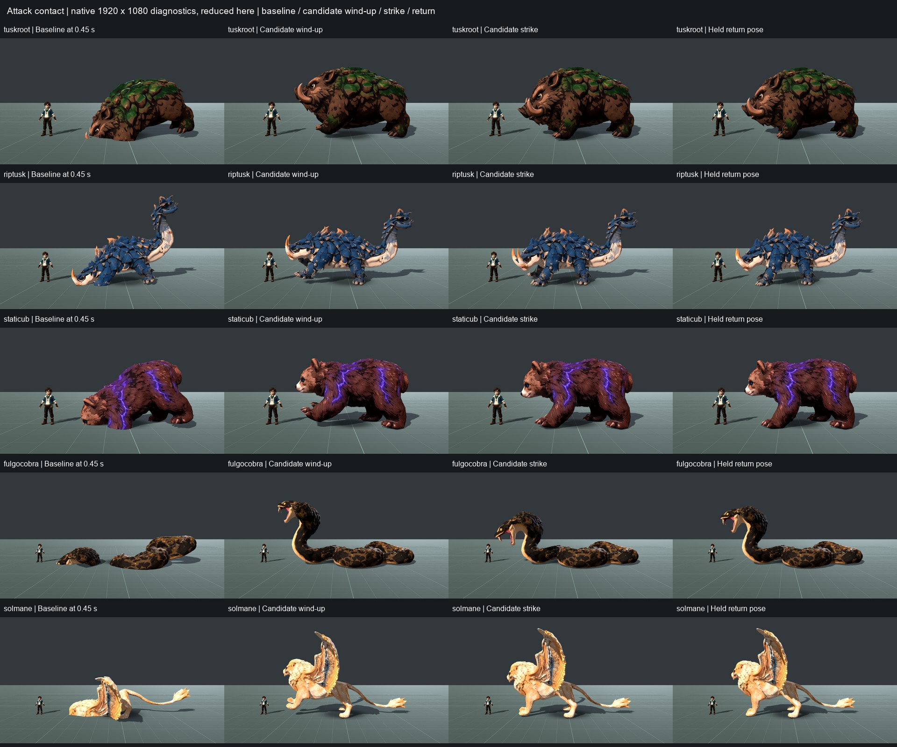
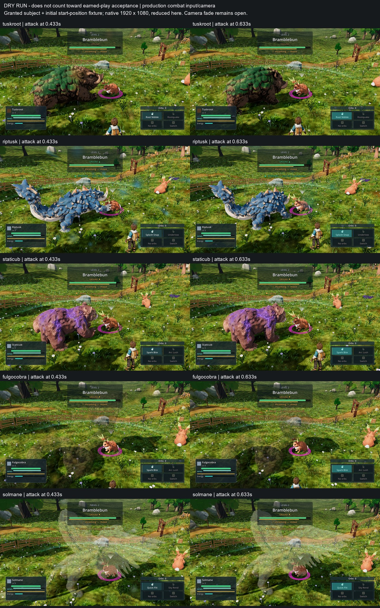
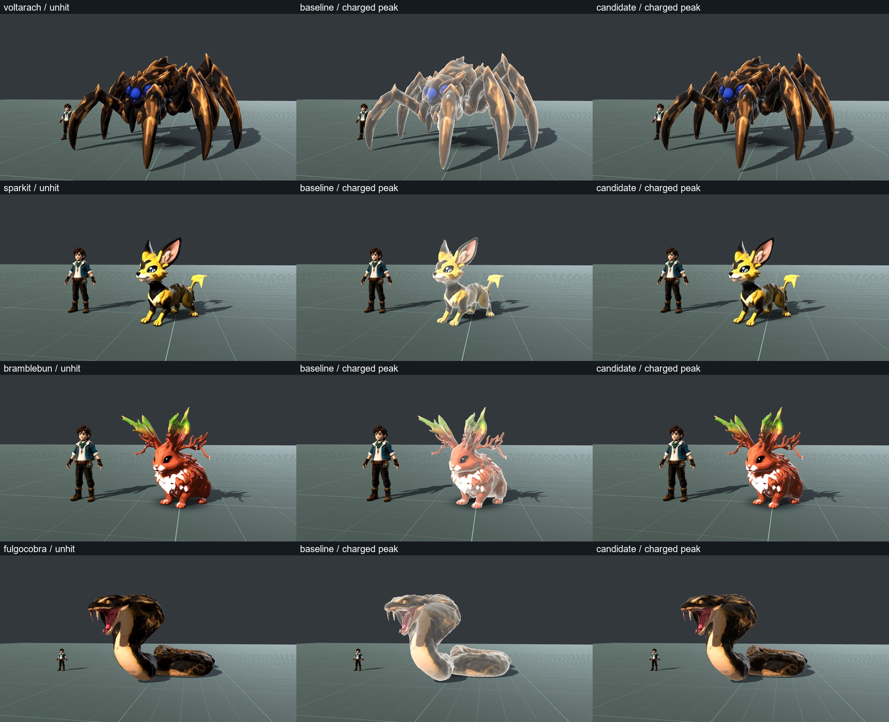
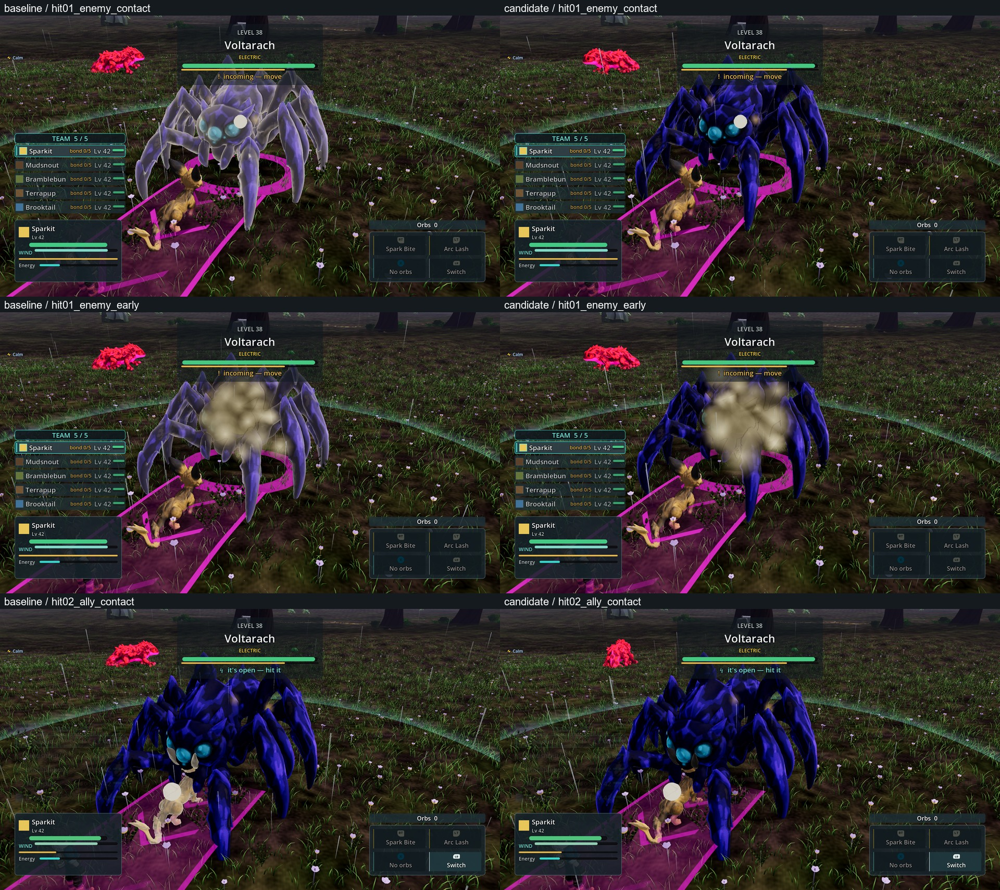

# Creature attack contact

X04 bug slice against ART_DIRECTION §5.1 and ACCEPTANCE §4, PR #342. Baseline
`7a6b45ee0` (integration 35); implementation `83d4a61af`, revised `d7138284a`,
with main `8203fb251` integrated through `c126bacfe`. Five installed attack clips
now retain visible body/ground contact and distinct attack phases. Whole-creature
and whole-game Bars A/B remain open. Claude owns integration.

The same PR also addresses the V-SW-4 body hit wash on main `7f875a85d`,
integrated through `0fb26c841`. The separate bounded evidence is below; the
original attack evidence retains its recorded build identities.

## Reproduction

**DRY RUN — does not count toward earned-play or full feature acceptance.**
The stage and combat witnesses below use declared fixtures. They diagnose and
validate the bounded asset repair; they do not close an ACCEPTANCE §6.1 criterion.
PR #342 remains draft under the newer WORKFLOW §8 finish-then-land rule.

`tools/capture_creature_attack_contact.gd` boots the production Meadows scene,
uses a disclosed species-adoption fixture and the existing smoke's one initial
position fixture, walks to a wild creature with movement input, engages through
interact, and sends one quick-attack input. It captures actual animation playback,
body position and terrain height through the production combat camera. It does
not alter fighter stats, terrain, animation time, body transforms during combat,
or combat timing. `--view=side` is an optional disclosed camera-yaw diagnostic.

Native Windows Godot 4.7 Compatibility, GTX 1060 3 GB. The first baseline
requested 1920×1080 but Windows constrained its client area to **1920×1061**;
those images are diagnostic evidence. Subsequent captures use a borderless window
and record the actual viewport dimensions in the trace. Fixed 60 Hz
capture is visual evidence, not performance telemetry or earned progression.
Shared `D:/tetherbound/RENDER_LOCK.json` must be held by `combat`.

```
godot --path . --rendering-method gl_compatibility --borderless --position 0,0 \
  --resolution 1920x1080 \
  --fixed-fps 60 --script tools/capture_creature_attack_contact.gd -- \
  --species=tuskroot --out=<absolute-output-directory>
```

Tuskroot baseline completed with 61 frames, no harness failures, exit 0. At
`tuskroot_production_028.png` the front of the creature visibly sinks into the
ground. Raw local evidence: `shots/attack-contact-baseline/tuskroot/trace.json`
and its associated PNGs. Existing world-placement warnings were present.

An independent CPU skinning evaluation sampled the five installed clips at
approximately 240 Hz, including exported keys. Bind reconstruction agrees with
source vertices within 4.8e-7 model units. At the production fitted scale, minimum
heights relative to the bind floor were:

| Creature | Attack start | Worst sample | Worst time |
|---|---:|---:|---:|
| Tuskroot | −0.292 m | −1.306 m | 0.458 s |
| Riptusk | −0.665 m | −1.147 m | 0.454 s |
| Staticub | −0.644 m | −1.197 m | 0.458 s |
| Fulgocobra | −1.287 m | −2.508 m | 0.458 s |
| Solmane | −1.571 m | −3.127 m | 0.458 s |

These figures measure deformed skin against a flat bind plane, not live terrain.
The common authored pelvis/spine fold drives the front below that plane. Some
channels also lack a neutral frame-zero key. Anatomy differs: cobra coils use
nominal leg bones, while Solmane's actual hind contact is predominantly root
weighted. A uniform whole-body lift would introduce visible floating.

## Change and invariants

Tuskroot/Riptusk use shoulder and forepaw anticipation, a downward strike and
return; Staticub/Solmane use forepaw and upper-body motion; Fulgocobra uses its
head/neck while its coils retain their support. Neutral keys bound every edited
rotation channel. Small authored translations clear the near forelimb on
Tuskroot/Riptusk and both forelimbs on Staticub. They do not lift the whole model.

The GLB transformation appends attack keys and redirects only attack rotation
and those named forelimb-translation samplers. Original binary data, geometry,
skin weights, materials, hierarchy, other clips, scale channels and root/pelvis
translations remain unchanged. Duration remains 0.958333 seconds. Source SHA-256
and invariant fingerprints are pinned in `tools/art_pipeline/author_attack_candidates.py`.
Tuskroot's asset also serves Ashtusk; the other four have no exact-path base-roster
aliases. No gameplay or combat/camera code changes.

The small evaluator and generator require NumPy. Optional CPU diagnostic figures
also use Pillow; these figures are measurements, never 3D art approval. To author
from a checkout containing the pinned original assets:

```
python tools/art_pipeline/author_attack_candidates.py --input-root <original-checkout> --output-dir <outside-checkout>
```

To check the installed candidate without changing it:

```
python tools/art_pipeline/author_attack_candidates.py --input-root . --output-dir <outside-checkout> --check-only --no-figures
```

## Verification and review

- Native import exits 0. The independent source reviewer verifies the original
  binary prefix, mesh/skin/material/hierarchy, other clips, duration and neutral
  boundaries against `git show 7a6b45ee0`. No asset correctness blockers.
- The installed-asset checker passes all five, including the revised two. It
  evaluates approximately 240 samples/second against the bind plane, fails above
  1 cm penetration and checks neutral boundaries and pinned invariants. The worst
  residual is Staticub at **−0.000209 m**; others are floating-point noise. This is
  a sampled flat-plane result, not a guarantee for every terrain pose. Original
  Tuskroot fails the same neutral-entry regression check (0.8196 m maximum vertex
  displacement from neutral); its original attack also penetrates as tabulated.
- Posterior patches on revised Tuskroot/Riptusk retain their original positions
  within 0.00000045 m. Their original bind minima are respectively 4.14 cm and
  1.24 cm above the whole-mesh floor; unchanged position alone is not proof of
  literal foot-floor contact. Native images supply the visual judgment.
- `capture_creature_attack_stage.gd` uses the unchanged calibrated audit stage,
  production fit and AnimationPlayer, with **external `--fixed-fps 60`**. It
  captures uninterrupted playback without seeking. Body physics is disabled by
  the existing stage helper, so the endpoint is the authored held neutral pose,
  not the production return-to-idle transition. Verified 1920×1080: baseline
  195 frames, first candidate 195, revised Tuskroot 39 and revised Riptusk 39;
  zero skipped, all exits 0. Only the latest two sequences represent those assets.
- Independent image-only review prefers the candidate on all five for contact.
  The first Tuskroot/Riptusk motions were rejected as too stiff; the final matched
  C/D review prefers the revision and **accepts the bounded contact-plus-motion
  repair**, with distinct anticipation, strike and return and no blocking new
  anatomical defect. Staticub, Fulgocobra and Solmane retain their first scoped
  acceptance. Full Bar A/B are **not demonstrated** by these diagnostic stages.
- Production combat dry runs on all five final assets complete: **61 frames
  each, 305 total, zero harness failures, all exits 0**. Every PNG and trace
  viewport measures 1920×1080. Animation traces observe attack through 0.9333 s,
  then an enemy hit reaction near the 0.9583 s clip endpoint, then idle. This
  proves the observed combat/blending path, not a clean uninterrupted
  attack-to-idle transition. The stage supplies the complete authored return.
  Captures use `c126bacfe` for Staticub/Fulgocobra and `d7138284a` for the others;
  the former two assets and combat code are identical between those commits.

Numerical provenance: [compact metrics](creature-attack-contact-metrics.json).
Native comparison, reduced only for the report:



Production dry-run [trace summary](creature-attack-combat-summary.json), with
the remaining large-creature camera problems visible:



Raw stage evidence: `shots/attack-stage-baseline-native/`,
`shots/attack-stage-candidate-native/`, `shots/attack-stage-revised-native/`
(Tuskroot) and `shots/attack-stage-revised-riptusk-native/`. The raw PNG dimensions
were checked; earlier `baseline` and `baseline1080` directories contain constrained
1920×1061 diagnostics and are not the final native comparison.
Combat raw evidence: `shots/attack-contact-candidate-native/` for Staticub,
Fulgocobra and Solmane; `shots/attack-contact-revised-native/` for Tuskroot/Riptusk.

Image review used `tetherbound-meadows-keyart.png` and the five
`palworld-01-boss-fight-forest.jpg` through `palworld-05-base-building.jpg`
references. Reviewers inspected all first-round A/B sequences, native attack poses
and final C/D Tuskroot/Riptusk sequences and native poses, without source/narrative.

## Remaining visual scope

The judge retains modest weight transfer, hinged limb motion, stiff cobra coils,
limited Solmane wing response, Tuskroot's soft chest bend and Riptusk's inactive
tail. Solmane's bright material still loses facial/shoulder detail. This slice
does not certify finished creature animation, other clips, slopes, riding,
night/weather or the required 30-second principal-subject matrix.

Actual combat also exposes heavy proximity transparency and head cropping on
large creatures, particularly Fulgocobra. Those remain open in AUDIT V-CX-1; fixing
the asset floor fold does not accept the player-camera view. Hardware performance,
full chapter/whole-game Bars A/B and pre-merge engine CI are not claimed.

## Hit-body readability (V-SW-4)

**DRY RUN — does not count** toward earned-play or full visual acceptance.
The baseline overlay bleaches Voltarach's shell and limb shading at the instant
of damage, including during an enemy tell. This is an extra blended material
pass; it does not reduce the original body's opacity. The independent proximity
fade/head-crop problem in V-CX-1 remains separate and open.

Only `data/config/vfx.json::hit_flash` changes: quick strength 0.9 → 0.3,
charged 1.0 → 0.4, flat mix 0.3 → 0.05, rim power 1.6 → 2.8. At peak this caps
the overlay contribution at 30%/40% on the silhouette and 1.5%/2% on a surface
facing the camera. Duration stays 0.16 s. Impact sparks, hit animations, shader,
level-up pulse, body materials, camera, combat authority and gameplay are unchanged.
Remote presentation inherits the ordinary quick-flash settings through its
existing path. Reduced-motion behavior is unchanged.

`tools/capture_creature_hit_read.gd` freezes each production body/animation in
the calibrated stage and advances the production overlay manually to 0/40/100 ms
for quick and charged hits, with unhit/restored controls. Four subjects cover
thin spider limbs, fur, a light chest/foliage and broad cobra surfaces: Voltarach,
Sparkit, Bramblebun, Fulgocobra. Each version supplies 32 native 1920×1080 PNGs,
zero skips, exit 0 and empty stderr. This diagnoses the overlay component;
it does not prove uninterrupted motion or habitat readability.

`tools/capture_creature_hit_combat.gd` extends the existing Stormwood named-fight
witness: production world, input Engage, AI and quick-attack input. It uses the
parent's disclosed level-42 party, initial placement, nearby-wild hiding,
Calm weather pin and end-of-run flee fixtures. Both captures start the actual
Hollows Alpha/Voltarach fight and observe real hits on enemy and ally. Additional
frames follow damage signals and record actual overlay strengths. Baseline
contact samples show 0.9; candidate contact samples show 0.3.
Baseline supplies 65 PNGs and candidate 74; all 139 combat PNGs measure
1920×1080. Both processes exit 0 with no script/runtime errors. Damage rolls and
later combat timings vary between runs; the first hit is the matched comparison,
not a claim of pixel-identical world simulation.

Capture limits: the parent saves only one simultaneously due request, so some
scheduled samples are omitted. Damage signals may precede projectile arrival;
the filename alone does not prove a flash. Use the recorded nonempty strengths.
The parent exit code does not validate encounter success or PNG saves: the
summary, files, dimensions and logs are checked independently. These are fixed
60 Hz captures on Windows Godot 4.7 Compatibility/GTX 1060 3 GB, not Ally or
performance evidence. Existing world-placement/deprecation warnings occur.

The existing combat VFX suite passes **14 tests / 81 assertions / 0 failures**,
with no script errors or warnings. Independent source review finds exactly four
presentation-value changes and no correctness blocker; the capture limits above
come from that review. No new implementation-mirroring test is added for this
reversible config retune.

The code-blind reviewer inspected all 64 isolated stage images and confirms the
candidate preserves each species' colors, face/appendages and solidity, with the
baseline broad whitening removed. Fulgocobra's hood/coils show the clearest gain.
The remaining edge cue is faint; quick versus charged cannot reliably be named
from the body overlay alone in these stills. This is not a charge-class cue pass.
The same reviewer inspected seven matched production frames per version and
accepts the bounded removal of whitening: Voltarach's tell body remains solid,
Sparkit's gold body/dark ears remain visible, and contact spots plus the following
burst/ring/particles keep the overall hit response visible. The existing early
particle cloud still covers much of Voltarach's face and Sparkit's torso in both
versions. Face readability throughout impact, charged distinction, continuous
reaction timing/weight and full Bars A/B remain open. The reviewer read images
only, with no source/configuration inspection.

[PNG hashes, dimensions, fight summaries and overlay samples](creature-hit-evidence.json).
Raw local directories: `shots/hit-read-baseline-wide/roster`,
`shots/hit-read-candidate/roster`, `shots/hit-combat-baseline`,
`shots/hit-combat-candidate`. Earlier tight-framing stage directories are not the
matched comparison. Reproduce with the two named tools, `--fixed-fps 60`, native
1920×1080 borderless Compatibility and the shared render lock; combat additionally
uses `--ids=hollows_alpha --seconds=14 --interval=2 --out=<absolute directory>`.




