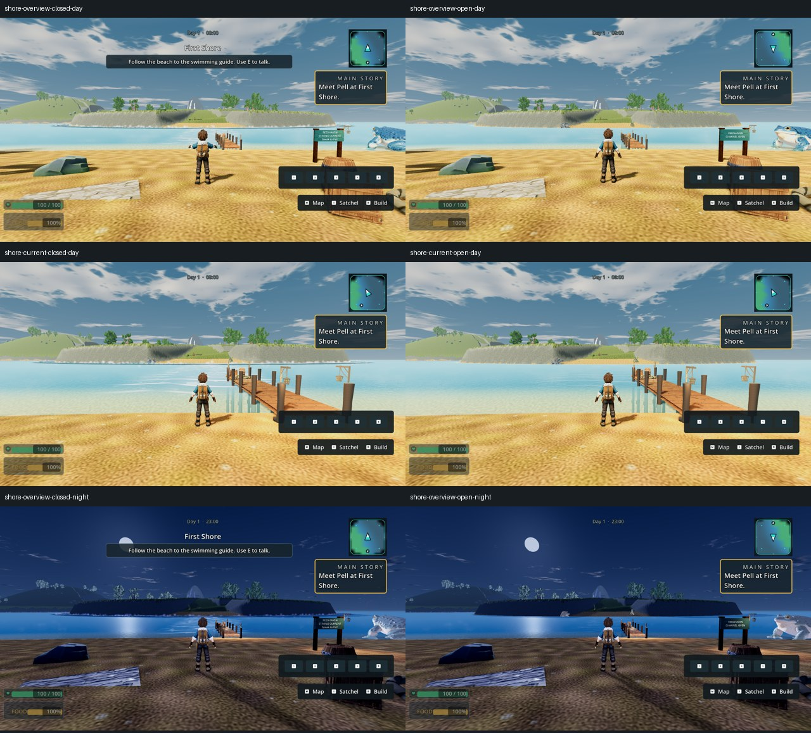

# First Shore's current boundary — draft visual repair

X04 / WORLD §6.3 and §6.6; owner explicitly rejected the freestanding First
Shore fence because it does not prevent access. Implementation `d3c3764af`,
based on main `cb9c5eb4a`. PR #329 stays draft: **environmental crossing-state
clarity does not pass**. Claude owns merges.

## Reproduced cause and change

The ten-metre fence stood roughly thirteen metres inland on a much wider
beach. It could be bypassed on either side. Existing progression enforcement
comes from the six-metre-per-second adverse route current and the outward tide
race around Reedhaven, both controlled by `water_swim_lesson_complete`.
The current renderer ignored that flag and displayed the authored open speed.

Only First Shore's fence **and collider** are retired. This is explicitly a
small collision removal; it is not described as presentation-only. The six
other mandatory dock blockers remain. A compact installed-family timber notice
beside the approach reports the existing route state and persists after opening.
A shared-family lantern lights its shaded lettering. No new transaction,
interaction, entitlement or current strength is introduced.

The current renderer binds the same closed-dock and exact return-shortcut facts
as physics, refreshes when effective velocities change, and rebinds replacement
world flags. Final restoration applies each route's multiplier once. The foam
pattern changes from long parallel streaks to broken transverse crests; this
iteration remains visually insufficient.

## Verification

- Focused current-field, current-view and notice tests: **13 tests, 148
  assertions, zero failures**. Includes shared physics parity, live flags,
  replacement-world reload, effective shader motion, notice grounding and
  clear approach, no notice collision or progression writes.
- `smoke_tidewake_b_current_restore.gd`: **20 checks, zero failures**; production
  Guardian settlement, world save/load and retained calmer physics/presentation.
- `smoke_water_first_shore_current_gate.gd`: **zero failures**. Real production
  scene; First Shore collider absent, other six blockers present. One initial
  position fixture at the authored sheltered-current centre, then ordinary
  forward input. Closed attempt z217.9999 →210.5765; same swimmer after the
  directly posed existing lesson flag z211.1832 →221.7093. This proves bounded
  current rejection and opening, not earning the lesson or complete crossing.
- An earlier probe at x0/z220 reached an overlap/edge balance point instead
  of sustained pushback. The revised smoke deliberately tests the authored
  sheltered centre x−9.6. Per-route full-strength visual encoding does not prove
  exact spatial overlap/edge parity or close every possible flank.
- Twelve native Windows 1920×1080 Compatibility captures under
  `shots/shore-current-r3` compare closed/open overview, notice and water by day
  and night. Production camera, teleported stands and directly posed flags are
  disclosed visual fixtures. Godot 4.7 `5b4e0cb0f`, GTX 1060 3 GB, driver 560.94.
  No script/shader errors; preexisting deprecated interpolation warning remains.

## Independent review and unfinished acceptance

`shore_portal_review` found no source blocker: First Shore-only removal,
unchanged current/lesson authority and other docks, correct per-route state
adapter, landward physical notice and reload handling. Its unnecessary forced
mesh rebuild on unrelated restore callbacks was removed.

Code-blind `shore_current_blind_judge` inspected all twelve frames and references.
The open state looks calmer and the unobscured sign wording is readable, but
closed water still reads as angular surface graphics or a highlighted route.
The distant tide-race puffs remain conspicuously repeated. It does **not** accept
environmental crossing-state clarity. The notice-centred camera also puts the
trainer in front of the text; an oblique ordinary-camera witness is still needed.

Whole-frame A is **no**. B is **yes only for recognizable genre ambition**, with
an explicit failure of shipping-quality parity; this is not a visual-bar pass.
Broad empty sand/sky, engineered cliff walls, sparse stippled foliage, glossy
creature versus dark props, oversized rope and disconnected paving remain.

The next water iteration must change the flat graphic treatment rather than
merely brighten it again, and needs native temporal evidence. Actual rough
water/shore integration, full closed-route flank proof, mounted/guest movement
and Ally performance remain open. Portal replacement was separately merged as
PR #328; these captures preceded that main merge.
