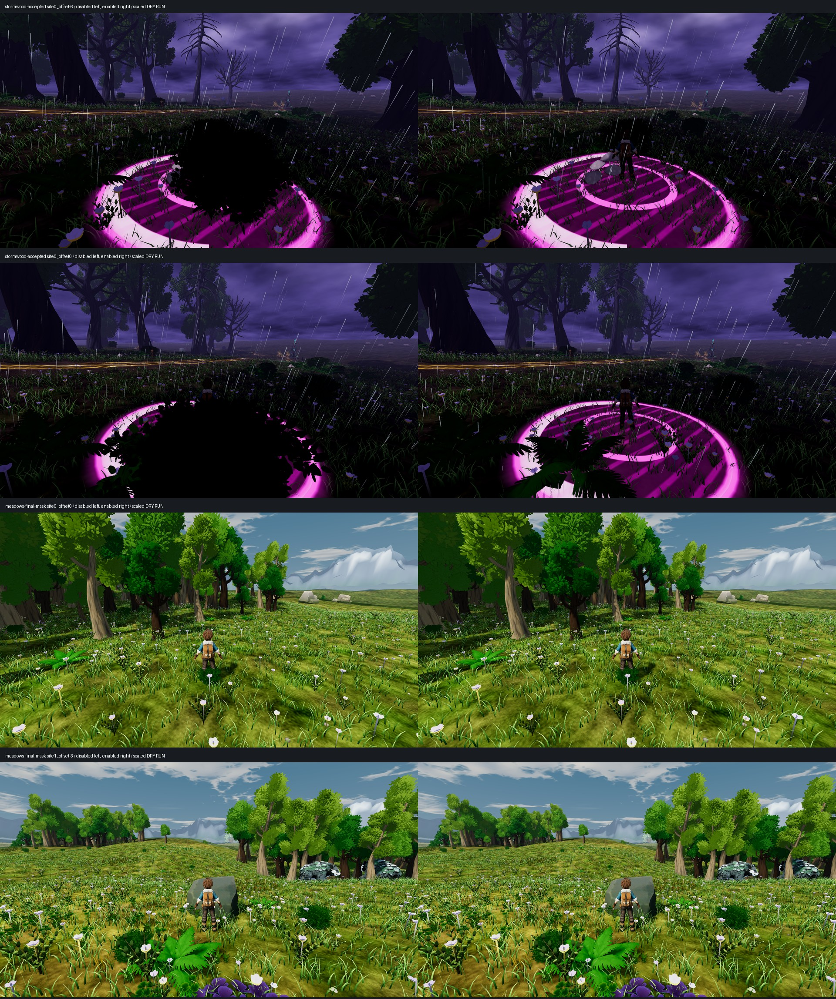

# Near-camera bush and fern visibility

The Stormwood strike follow-up exposed a broader exploration problem: a nearby
bush could fill the production camera while the trainer and warning footprint
remained behind it. The shared vegetation renderer now gives non-colliding
`Bush_Common`, `Bush_Common_Flowers` and `Fern_1` surfaces a camera-distance fade
only when their per-instance projected bounds overlap the central trainer
corridor. Eligible fragments are clear below 5.8 m and opaque beyond 8 m.
The bounds check is conservative: it is not an exact leaf/depth intersection.

The separate config avoids changing scatter bake fingerprints. Imported mesh
geometry, LODs and shadow mesh remain on a shallow mesh copy. A restricted leaf
shader carries the source albedo texture/tint, roughness, backlight, vertex tint,
two-sided cutout and alpha-to-coverage. Parsed source glTFs contain no other PBR
maps; the vegetation retint disables specular. Solid or unspecified collision layers and all unlisted
models are excluded. No placements, harvest state, combat rules, collisions or
save data change. Tidewake's separate water vegetation renderer is unaffected.

## Evidence and limits

Baseline is `955b89ae5`, including main `1ba253eb0`. Native captures use Godot
4.7 `5b4e0cb0f`, Compatibility/OpenGL 3.3, GTX 1060 3GB driver 560.94, at
1920 by 1080. Paired controls swap between the original BaseMaterial3D and the
scoped leaf ShaderMaterial on the same registered mesh; weather continues between frames. This is a
material control, not a second checkout or a deterministic pixel-diff test.

Stills use one Stormwood site and two actual Meadows bush sites, with five
stands per site. The production CameraRig and trainer are retained. Stormwood
warning progress is staged at 0.5. Additional exploration pairs use -45 and +25
degree camera pitch. Movement uses two seconds of scripted
`move_forward` input after a debug arrival, with real locomotion, grounding,
animation and the production camera. Captures are **DRY RUN**, not earned-route,
full chapter, audio, co-op, Ally-device or performance proof. The second Meadows
site faces a solid boulder and is covered by stills, not a forced traversal.

The first 3.5–7.5 m bush-only candidate restored target visibility but left dark
stippled leaves over the bright warning circle, plus an unfaded foreground fern.
Extending the distance fade to ferns and moving the transition behind the
trainer improved Stormwood, but the independent judge rejected its unnecessary
Meadows clearing. The approach changed to projected-bounds gating; distance-only
candidates are not the delivered implementation. Earlier Meadows captures emitted a capture-only null
Stormwood HUD error and are excluded from clean validation; the tool now hides
world CanvasLayers directly and rejects headless execution.

Independent source review found no current-asset material/serialization blocker: copied material scope,
deny-by-default collision policy and unchanged bake/placement paths were checked.
The synthetic mesh test checks resource isolation, original vertices, shared
shadow reference, palette and alpha-cutout preservation. It is not a native
import/LOD inspection of every model. Source/config changes require a process
restart because the config is cached. Distant bounds skip the eight-corner
projection, but nearby vertices still incur that work; device cost is unverified.
The fixed corridor does not track every creature, ride or dialogue profile, and
can admit empty AABB space or foliage behind the trainer. Those cases remain open.

Shadow passes skip the camera gate and preserve the original leaf cutout. This
uses Godot 4.7's `IN_SHADOW_PASS`; the engine's light-view matrices must not be
treated as the gameplay camera. See the [official spatial shader reference](https://docs.godotengine.org/en/stable/tutorials/shaders/shader_reference/spatial_shader.html).

## Retained review

Independent code-blind review of the masked still pairs passes Meadows material
and ground-cover preservation. The fern, lower-left bush and right-side bush
at site 1 / offset -3 remain; the prior sparse hole and unrelated dither are
gone. No obvious palette, lighting or alpha regression was found. At site 0 /
offset 0, the small bush still obscures boots, while the trainer remains readable.

Stormwood passes recovery of the trainer at offsets -6, -3 and 0 while retaining
peripheral plants. The foreground fern at offset 0 still hides a substantial
front-left portion of the hazard. A small stippled patch persists behind the
trainer at offset -3. Full danger-footprint visibility and dither finish remain
open; this is not closure of V31 or full Bars A/B.

Retained evidence totals **526 native frames**: 14 Stormwood stills, 28 Meadows
stills and 121 frames for each of four movement passes. All four final capture
processes exit zero, with complete manifests and no script/renderer error;
existing placement, prop-glow and interpolation warnings remain. The focused
tests finish **12 tests / 311 assertions / 0 failures**, with empty stderr.

Independent review inspected all 42 final stills, 18 Stormwood movement samples
(paired 000/030/060/090/120 and 029/031/089/091), and ten Meadows movement samples
(paired 000/030/060/090/120). It passes the sampled trainer recovery and retention
of surrounding plants/materials. Stormwood pitch +25 recovers the previously
hidden trainer; -45 causes no needless clearing. No hazard is staged in the
angle or movement frames, so these do not prove hazard readability there.

The 121 Stormwood motion pairs have exactly matching player and camera positions
and travel 9.8764 m. Meadows is **not an exact time-paired comparison**: the first
control frames remain stationary while the candidate begins moving. Maximum
same-index player/camera differences are 1.3210/1.3207 m; travel is 8.5648/9.8534 m.
The reviewer independently noticed the different positions/poses. Those samples
support retained appearance along the route, not a measured visibility gain.
Selected neighboring Stormwood frames show no contradictory state, but neither
sequence's selected stills establish smooth playback. Local fine stippling
behind the head/shoulders persists at Stormwood frames 029–031.

[Native paths, hashes, camera records and paired trajectory measurements](foliage-camera-evidence.json)
are retained beside this report. The contact sheet below is scaled for review;
the source PNGs are 1920 by 1080. Full Bars A/B remain open.

