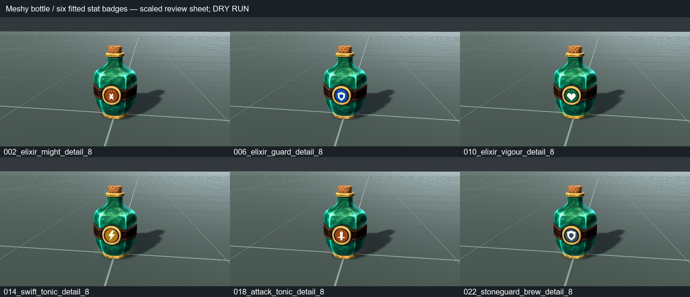
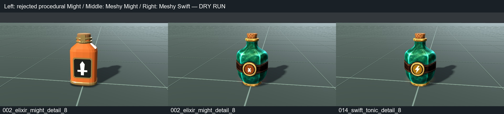
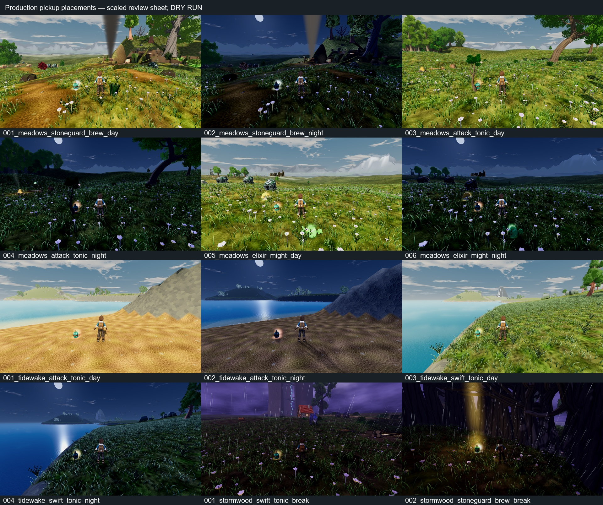
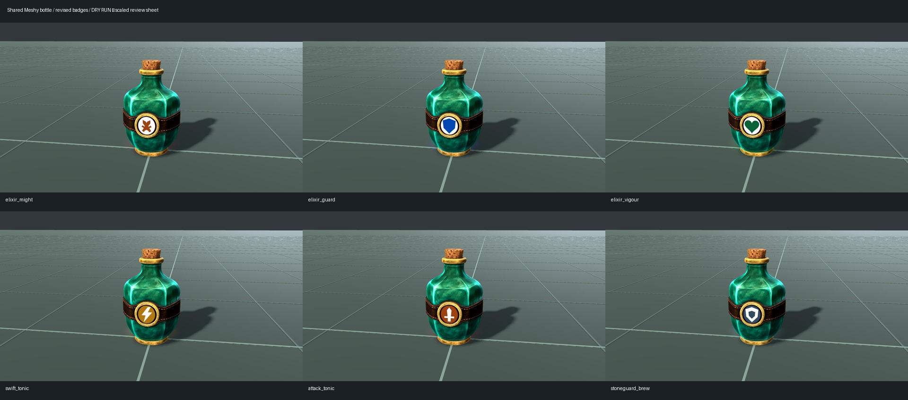
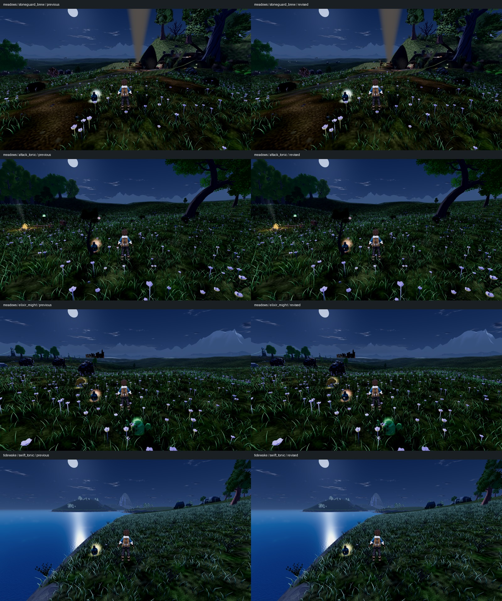

# Shared Meshy stat-drink bottle — X04 / V-CX-3

The owner requested one Meshy bottle with a different badge for each drink.
The six scenes now share one sea-green bottle with rounded shoulders, cork,
stitched leather and brass trim. Small fitted badges identify Might (crossed
swords), Attack (single sword), Guard (blue armour), Stoneguard (slate armour),
Vigour (green heart) and Swift (ochre lightning). Permanent elixirs also carry
light enamel fields with dark stat marks, while temporary tonics use dark
fields with ivory marks. Front and reverse badges now have the same usable
face size. This broad class treatment replaces the earlier three tiny pips.

This replaces unrelated barrel/crate/plant stand-ins at 26 existing loose
finds: four Meadows, twelve Stormwood and ten Tidewake. Guard and Vigour also
receive the shared model definition but currently have no loose-world placement.
Item effects, quantities, rewards, authored positions, IDs and claim/persistence
behavior are preserved. Three explicit Meadows harvest overrides use the same
scenes as the metadata-driven cache paths.

The Stormwood display correction keeps the authored interaction root and prompt
in place while moving only the bottle and its shared glow to terrain. Its
unscaled presentation anchor excludes the separate reward beacon from glow
bounds. Bottle metadata opts out of the pocket reward's 2.2x display enlargement.
Existing pocket beacon behavior remains intact.

## Provenance and implementation

- Meshy task `01a0e076-a807-73f5-9c96-b1fba0d4c41e`: one textured image-backed
  candidate, **30 credits** (13695 → 13665), generated from the inspected
  agent-drafted reference in `assets/props/stat_draughts/reference/bottle.png`.
- Adjacent `provenance.json` retains both prompts, task ID, dates and reference/raw
  GLB hashes. No credentials or signed download URLs are stored.
- Shared base: 9,858 triangles, one material, preserved 2048px Meshy albedo.
  Ground-origin height 0.80m, ordinary world scale 0.8, resulting height 0.64m.
- Current badge triangles: Might 384, Guard 232, Vigour 440, Swift 240,
  Attack 288, Stoneguard 272. Every complete pickup remains below 10,300 triangles.
- `tools/art_pipeline/author_stat_draught_models.py` normalizes the source and
  creates six small badge GLBs plus scenes referencing one shared bottle.
  Rebuilds can reuse the committed base without another Meshy call.
- Implementation `edba05c92`, integrating GitHub main `7f875a85d`. Claude's
  checkout was not edited. PR #355 is the handoff; Claude owns integration.

## Initial verification and limits

All images are **DRY RUN — does not count** for earned-route or whole-game
acceptance. Fixtures set stands and clock, park the companion and pause
encounters. Region frames use the production CameraRig and actual authored
pickup placements; the stage exercises both production pickup loaders.

Godot 4.7 `5b4e0cb0f`, Compatibility/OpenGL 3.3, GTX 1060 3GB driver 560.94.
Actual PNG headers are checked at **1920×1080**, after forcing the viewport
following the first frame. Scaled review sheets are not native-resolution proof.
Raw local paths, hashes and placement/grounding receipts are retained in
`MESHY-DRINKS-EVIDENCE.json`.

Final focused tests: **34 tests, 799 assertions, 0 failures** across stat-drink
imports, cache pickup behavior, shared pickup glow and Stormwood pickup runtime.
Live-tree smoke on the real Compatibility backend: **7 completed cases,
156 assertions, 0 failures**, exit zero and empty stderr. This checks all six
production bottles and direct teardown. It includes root/prompt/claim data, scale, single glow
registration through repeated offsets, exclusion of reward beams, and teardown
after claims and direct removal, including the actual halo MultiMesh transforms.

The two initial live-tree checks were incorrectly placed in the pure unit
runner, which executes before Godot exposes the scene tree. Its green summary
hid script errors; those cases were moved into
`tests/smoke_stat_draught_presentation.gd`. The standalone smoke requires a
completion/assertion count and has a failure watchdog. Run it with a real
Compatibility backend, not headless's dummy RenderingServer, which cannot
read back the MultiMesh transforms. The reported 34-unit/7-smoke results
supersede the earlier misleading 36-test summary.

Draft-PR CI is not engine verification: the observed run at `c8a77087c`
reported a green `ci-gate` while unit, region and export jobs were skipped.
The evidence above is from local engine runs; no packaged build is claimed.

Independent source/asset review: all badge binaries have zero degenerate
triangles, no inconsistent shared-edge directions and no normals opposing their
winding. Relief components are closed; the disc/rim boundaries are intentional.
Scene resource sharing, Meshy texture identity and reward preservation passed.
Blender rebuild reproducibility was not independently rerun.

Independent code-blind art-stage review: **bounded PASS** on all six front
badges, the repaired shield/lightning contours, sampled side/rear fit, material
finish and ground contact. Might's crossed blades now distinguish it from Attack
at trainer scale. Previous candidates with intersecting inlay faces are superseded.

Final retained local set: **39 native frames** (27 stage, 6 Meadows, 4 Tidewake,
2 Stormwood), four capture runs exiting zero with no skipped rows. Independent
code-blind regional review: **bounded PASS for bottle finish, pickup-kind
recognition, discoverability, integration and scale** in all three regions.
Tidewake Attack on bare sand gives the strongest visible grounding witness;
vegetation and glow obscure precise base contact elsewhere. Measured base-to-
ground gaps are zero in Meadows/Tidewake and under 0.000002m in Stormwood.

**Specific effect/permanent-class recognition at the production camera remains
FAIL.** Badges occupy roughly ten pixels in these stands and become very dark
at night; reverse-facing Might cannot reliably be distinguished from Attack.
The glow locates the pickup without identifying its stat. Meadows Attack also
has a sapling overlapping the silhouette. These findings remain open rather
than being hidden by the successful close-up art review.

Meadows Swift remains a coverage gap: the earlier fixture stand put the camera
inside scenery, so it is excluded instead of counted as evidence. Side-on stat
identification is weak, reverse marks are smaller, and Guard/Stoneguard still
depend chiefly on colour and the permanent pips. Held-item scale, earned pickup
sequences and complete visual Bars A/B are not claimed.

The comparison below shows the owner-rejected procedural candidate beside the
new Meshy candidate; it is not a before capture of GitHub main's stand-ins.

## Badge readability follow-up

Latest main `8bd3a6462` is merged into the same owned branch. The Meshy bottle
binary, texture, world height, placement anchors and all item behavior remain
unchanged. Only the six authored badge binaries change. No further Meshy run
or credits were needed.

A final fetch brought main `ce1a3c6e5`, merged through `1ce945b71`. Its only
production delta is an unmounted Deepwood dialogue-completion fallback;
inspection confirms no bottle, rendering, placement or material change.
The captures above were made on the `8bd3a6462` baseline.

Reverse faces grow from 70% to the full front-face size. Larger marks use the
space previously occupied by tiny pips; permanent elixirs now have ivory fields
and dark coloured marks, while temporary tonics have dark fields and ivory
marks. Guard's solid shield and Stoneguard's hollow shield remain distinct
without relying on blue/slate alone. Might's broader crossed blades separate
from Attack's single upright blade. Low emission (0.28) on ivory keeps the
contrasting marks visible at night without adding lights or changing the shared
pickup halo. Enamel colours, leather, brass and bottle remain normally lit.

Independent source/asset review found no blocker: zero degenerate triangles,
bad winding or opposing normals; glyphs remain inside their fields; sampled
bottle clearance is at least 5.28 mm. Only ivory is emissive. The shared base
is byte-for-byte unchanged, and default badge rebuilds no longer rewrite it.
Current assets are smaller than the previous version (10,090–10,298 triangles
including the bottle). The two import/model tests pass **49 assertions**, with
no error diagnostic, after the new asset import.

Five native capture runs exit zero with zero mechanical skips: 27 stage,
8 Meadows, 4 Tidewake, 2 Stormwood and 2 corrected Meadows Swift frames.
All **43 PNGs are 1920×1080**. The first two Swift views hide the pickup behind
the trainer and are excluded; their corrected stand puts the trainer beside
the actual pickup without moving it. There are **41 usable frames**.
Source/asset hashes, exact camera/grounding receipts and diagnostic heads are
in [MESHY-DRINKS-BADGE-EVIDENCE.json](MESHY-DRINKS-BADGE-EVIDENCE.json).
Existing world placement/interpolation warnings remain; no new script error
was observed. These are the same desktop Compatibility renderer and disclosed
DRY RUN fixtures as above, not earned routes or Ally performance evidence.

Independent code-blind review passes all six trainer-scale marks and the twelve
matched regional views for **learned mark/class differentiation and retained
night visibility**. The earlier blanket production-camera identity failure is
superseded for those views: shield, upright blade, X-like mark and bolt now
remain distinguishable without added bloom. Individual crossed-sword details
are still too small, and colours weaken at night. The light enamel is cleaner
and flatter than the worn brass, a minor finish tradeoff rather than a blocker.
Side-on reading, regional Guard/Vigour (neither has a loose-world placement),
arbitrary-distance naming and complete Bars A/B remain outside this verdict.

The corrected Meadows Swift day/night pair separately passes bottle integration
and discoverability, closing the invalid-view coverage gap. Its oblique glyph
and crossing grass still prevent confident bolt recognition from that stand;
the clearer Tidewake/Stormwood Swift views retain their differentiation pass.

