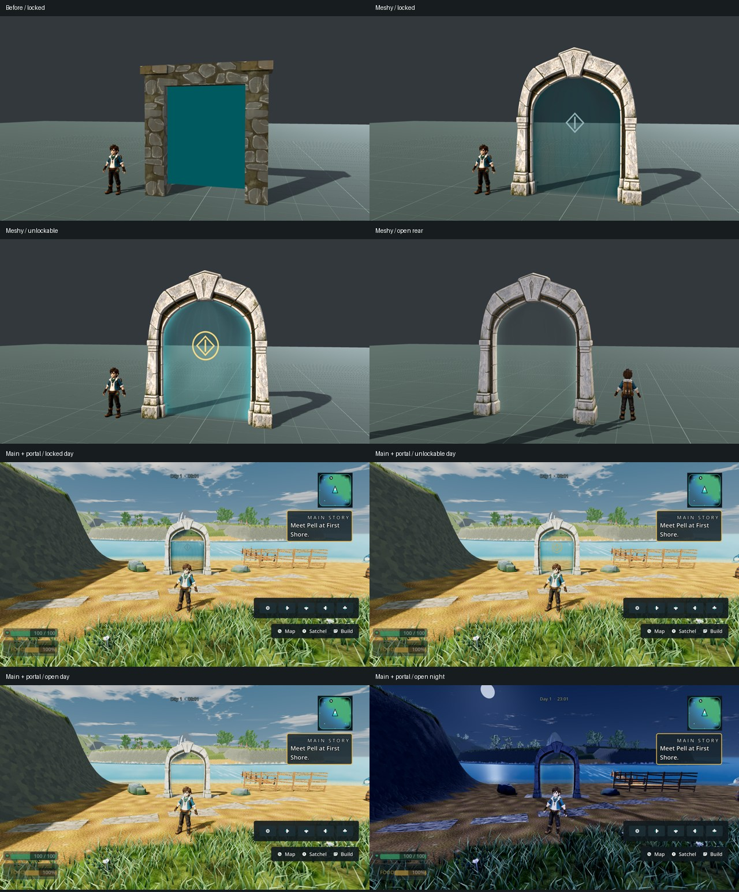

# Realm portal Meshy replacement

X04, owner's explicit portal Meshy request; ART_DIRECTION reference-backed art
and visual acceptance. Implementation `428ffaee9`, merged with main
`cb9c5eb4a` as `7802c72e2`. Claude owns merging PR #328.

The shared realm gate now uses one open masonry arch with bronze inner trim,
keystone and feet. A separate veil follows the measured aperture. Locked has a
subdued diamond seal, unlockable adds a gold halo, open clears the seal and
leaves a faint shimmer. The existing 3.15 × 3.75 × 0.64 m collision, state
ledger, interaction radius, unlock flags and travel destinations are unchanged.
The Meadows rift bridge is not replaced.

## Asset provenance

`assets/props/realm_gate_meshy/provenance.json` records the task, settings,
hashes and processor. The inspected generated reference and full prompt are
under `reference/`. Meshy image-to-3D task
`01a0dfa6-b9af-7159-912c-22caef713fdb` consumed 30 existing credits. No new
purchase. Raw signed URLs and credentials are excluded.

The installed model retains 10,568 triangles; 4.5 m wide, 5.2 m high, 0.9 m
deep. Whole-depth ray samples measure at least 2.98 m clear below 2 m. Blender
processor retains faces/UVs and fits piers monotonically. Independent review
caught a Blender roughness math node being lost in glTF; the fix exports a
constant 0.86. Inspection verified white roughness channel × 0.86, and the
runtime test checks that effective product. All three runtime texture sidecars
pass `texture_import_policy.py --check` after VRAM-compressed reimport.

## Runtime evidence

- Godot 4.7 stable `5b4e0cb0f`, Compatibility/OpenGL 3.3, NVIDIA GTX 1060 3 GB,
  driver 560.94; Windows native 1920 × 1080 captures.
- Merged-head focused tests: `realm_world_components,realm_gate_presentation`:
  **8 tests, 4,179 assertions, zero failed**. Covers effective imported material,
  measured aperture, distinct shader states, key retention and realm routing.
- Six front/rear neutral-stage captures cover locked/unlockable/open. These are
  explicitly posed visual states, not proof of earning progression.
- Production First Shore route: ordinary left-stick movement follows the
  existing gate-site witness to the front; ordinary look input faces the gate.
  Six day/night captures on `7802c72e2` passed. After walking, states are posed
  diagnostically without changing world flags. First Shore's actual return
  gate is open on arrival; its staged unlockable view is a shared-asset check.
- No script/shader errors in captures. Existing deprecated interpolation warning
  remains. Local full frames/manifests/logs are retained under `shots/` and the
  sibling `visual-acceptance-local` directory; only one contact sheet committed.

## Independent disposition and limits

Source review found no gameplay blocker after the material correction. Fresh
code-blind review preferred the replacement over both the primitive baseline
and earlier candidate, accepting **the portal asset and demonstrated stage
state differentiation**: seals now differ in both shape and colour, open is
clear, front/rear are coherent, no conspicuous missing faces or penetrations.

Whole-frame bars remain **A: no; B: no**. Disconnected rectangular paving,
unarticulated terrain/Veilfall silhouette, sparse planting, inconsistent night
materials and weak landing composition remain. First Shore's fence is expressly
**not accepted**: the owner correctly observed it cannot block the broad beach.
Its causal/current presentation repair is separate from this portal PR.

Static views do not prove motion aliasing, controller clearance through every
realm placement, multiplayer traversal, Ally performance or whole-game visual
acceptance. Shared consumers use the same frame; only First Shore placement has
new ordinary-camera evidence here. Those broader criteria remain open.
