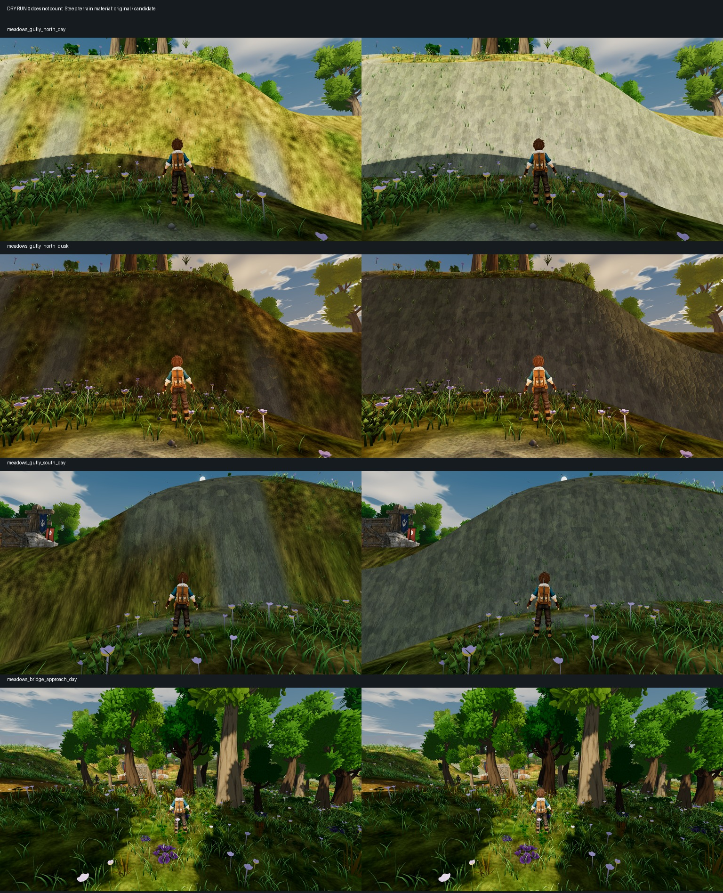
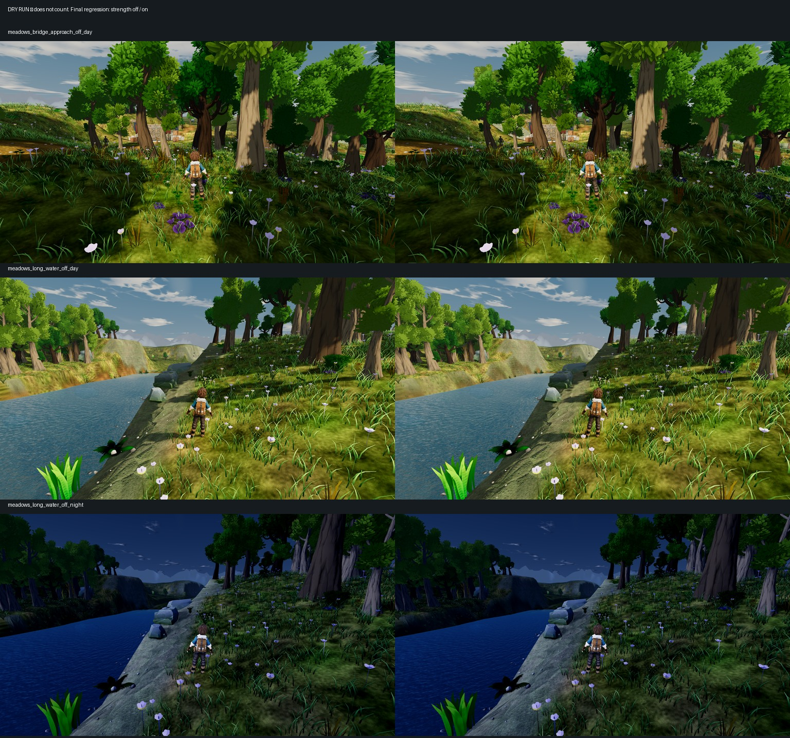

# Steep terrain material — V16

**Draft PR [352](https://github.com/MJohnsonWellabe/Tetherbound/pull/352). V16 and whole-game Bars A/B remain OPEN.**

**DRY RUN — does not count.** Production Meadows scene, lighting and CameraRig, with diagnostic position/clock fixtures, paused encounter director and companion parked behind the camera. These are material comparisons, not earned-play, motion, chapter or hardware acceptance.

## Result

The candidate exposes the installed rock material on steep rendered faces, including road-painted cuts. A code-blind judge preferred it in all three close wall comparisons, with no observed major ordinary-ground regression in the bridge approach. Both original and candidate **fail final wall finish and full Bars A/B**: pale repeating rock, smooth wall geometry, abrupt crest/base joins and grass blades on cliffs remain.

Baseline `c2ef0487b`; first candidate `0cee26d57`. Eight retained PNGs are actual **1920×1080**, verified from their headers, with hashes in [steep-terrain-material-frames.json](steep-terrain-material-frames.json). The two runs produced six frames each and exited 0. Quarry views are excluded: the day stand collapsed the camera against the trainer, and the day/night feet differed. The capture now rejects camera arms below 2m and records viewport dimensions. The quarry requires a valid new stand before assessment.

## Mechanism and scope

The old diagnosis that Meadows had no side projection was incomplete. The shader already projects both material IDs, including path slot 3, using each contributing control cell's normal. Flat neighboring cells can still contribute a top-projected material to a steep rendered face. The native gully view confirms the visible grass/path curtain; it does not independently isolate every contributor to that defect.

The new mask uses the rendered geometric normal. It is zero on faces with upward normal component at least 0.55, blending to full exposed rock at 0.25. The installed rock slot 2 is projected on signed world side planes. Albedo/height, normal/roughness, normal depth and AO blend together before existing regional treatment. Neutral normal samples retain the existing smooth or configured flat lighting basis. Four extra texture reads occur only inside the steep branch. Runtime tunables live in `terrain_presentation.json`; terrain heights, control maps, bakes, collision and routes are unchanged.

Independent source review found no blocker for the installed configuration. It checked 5,040 CPU normal cases spanning signed axes, diagonals, slopes and rotated camera frames: maximum neutral error `1.11e-16`, tangent-frame roundtrip `3.47e-16`, camera invariance `1.11e-15`; all remained outward. Another 1,001 samples at normal.y ≥ 0.55 produced exactly zero blend. Native captures compiled/rendered the candidate on Godot 4.7 `5b4e0cb0f`, Compatibility/OpenGL 3.3, GTX 1060 3GB driver 560.94.

Review also identified that new rock needed Long Water's existing earth/moss/strata mask. The follow-up applies that treatment to newly exposed rock and clamps the configured slot against the installed texture-array depth. New rock samples do not inherit the original detiling or mip-bias/depth-blur controls; repetition and distance quality remain visual limitations, not silently passed checks.

Final code `a0c5a8055`: six native on/off regression frames cover the bridge by day and Long Water by day/night. All six expected frames exist, with zero skips, full 5.2m camera arms and matching recorded camera/feet positions. The run exited 0 with no shader or script errors. The independent judge passed the sampled regression check: regional rock continuity improves, and no major new ground, shoreline or night-read defect is visible. Near-bank ground and water edges remain distinguishable. Existing Long Water checks passed: **6 tests, 211 assertions, 0 failed**. No full engine CI or device performance pass is claimed.

## Independent image verdict

The judge received eight native files named A/B, without implementation or baseline/candidate labels. A was the candidate.

- North/day: A preferred for coherent exposed rock; pale colour and fabric-like detail remain.
- North/dusk: A preferred for identifiable rock in shade; angular repetition remains.
- South/day: A strongly preferred; B's vertical stretching and grass/rock swaths were severe.
- Bridge/day: ordinary ground essentially tied; no major new route/foreground regression observed. Distant bank quality remains weakly sampled.

**Bounded comparative improvement: PASS. Final wall quality: FAIL. Whole Bar A and Bar B: FAIL.**

Cloudreach and Tidewake use different material paths and receive no fix from this PR. Their offending rendered surfaces require separate native identification. Claude retains terrain geometry/route ownership and merge ownership.
