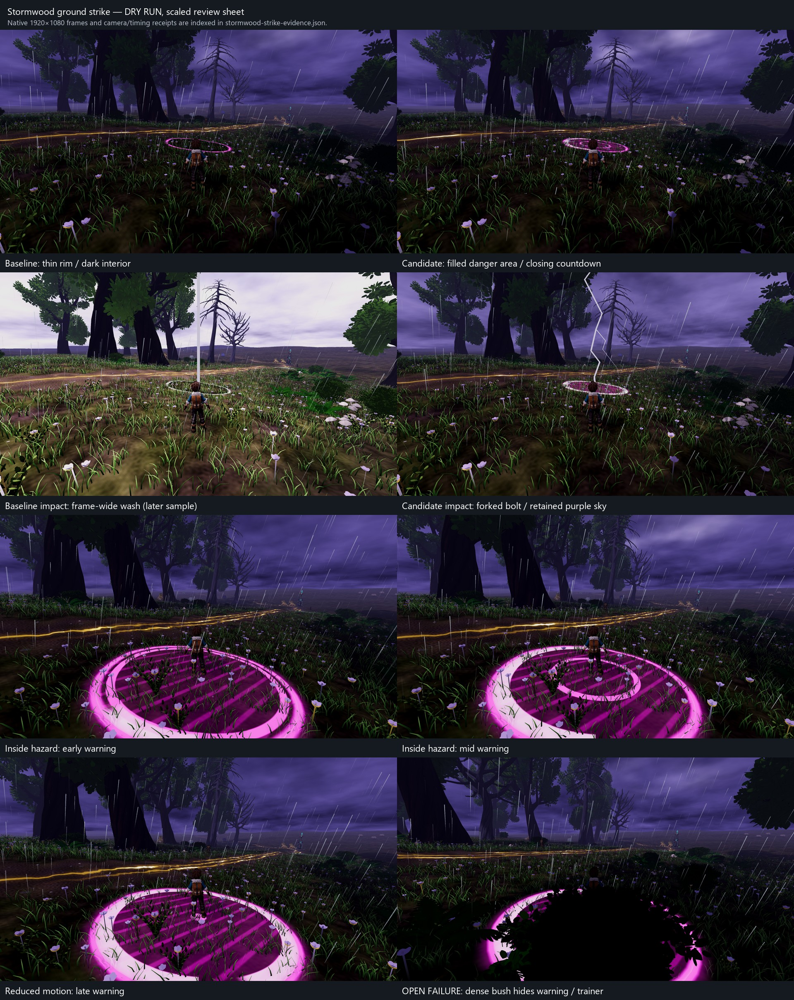

# Stormwood ground-strike presentation

The existing warning was a thin magenta rim with a dark interior. The impact
was a straight cylinder plus a sky flash that washed the purple environment
almost white. This revision fills the danger area with translucent magenta
hatching, closes an inner ring and fills a perimeter progress arc over the
production warning tween, and uses a local forked white-violet bolt with a
restrained whole-scene flash.

The outer boundary remains at 3 m throughout the 1.2-second warning. Reduced
motion keeps the countdown and bolt, removes the faint rim modulation, and
scales sky/local light once. The warning remains depth-tested; the interior
does not paint through trainers, bushes or walls. That preserves grounding but
leaves a substantial foliage-occlusion failure, recorded below.

This is work toward V31/V33, not closure of F10#3 or either visual bar. Surge
phase identity V32 and competing gold road veins V34 remain open.

## Current evidence and limits

All captures are **DRY RUN — does not count** for earned-route acceptance.
The harness mounts the production Stormwood world and CameraRig, teleports to
diagnostic stands, sets Break, suppresses random strike scheduling and
decorative flash scheduling, and delivers impact events with no damage hits.
It leaves the world geometry and vegetation intact.

Godot 4.7 `5b4e0cb0f`, Compatibility/OpenGL 3.3, GTX 1060 3 GB, driver 560.94.
The baseline has 24 native frames across two stands and both motion modes.
The final capture has 114 native frames across outside, inside and bush-covered
inside views, each in normal/reduced motion. Every retained PNG is 1920×1080.
The adjacent [manifest](stormwood-strike-evidence.json) records hashes, source
hashes, camera poses, target/player positions, progress, flash values and logs.
The review sheet is scaled evidence navigation, not native resolution proof.

The final sequence uses the real warning event/tween. At fixed 60 simulation
frames per second, progress advances from approximately .028 at sampled frame
0 to 1 at frame 70; the first sample follows two tween steps. The fixture then
delivers impact, captures its first three frames and later decay. It buffers
images during the sequence and writes them afterward. This verifies visible
progress against simulation frames; it does not measure real-time performance.

The baseline instead stages progress .1/.5/.9 and writes each PNG immediately.
Its impact sample is later than the final first-impact sample. The comparison
therefore establishes presentation class and scene wash, not identical event
time or pixel-difference quality. Earlier candidate captures are diagnostics,
superseded by the final `storm-strike-perimeter-timed` capture.

The original independent code-blind review passes the exposed verge's filled
area and fixed boundary, and the retained purple scene during both impact
modes. It fails the bush-covered view and finds progression weak from the
distant three-still set. A second review of the real tween from inside the
hazard identifies the final shrinking ring disappearing beneath the trainer.
The retained candidate therefore adds an accumulating perimeter progress arc,
without moving the outer boundary or changing the warning timing. No hidden
area or unsampled timing is assumed to pass.

The final independent code-blind review examines 18 native early/middle/late
frames across all three views and both motion modes. It gives the perimeter
addition a **scoped PASS**: sampled late stages remain distinguishable when
the centre is hidden, including exposed side arcs around the bush. It finds
no new boundary confusion or broad scene glare. The close late band is bright
and somewhat heavy, and the distant cue is modest. Exact countdown reading
from a single partial arc and perceived animation timing are not established.
The separate final bolt review passes its lightning silhouette, retained
purple scene and sampled decay endpoint, with polygonal/opaque finish still
a polish limitation.

**Unresolved:** dense bushes obscure the warning's interior, much of its
boundary and inner countdown, including while the trainer stands inside it.
The perimeter cue improves stage recognition but does not recover that missing
footprint. The same foliage also hides part of the trainer. Complete warning
readability remains open. The bolt's
angular silhouette improves on the cylinder; this is not a claim that its
finish or ground-contact effect has reached Bar B. Audio, earned encounters,
co-op visibility, Ally telemetry and the complete chapter frame matrix are
not supplied by these fixtures.



## Scope and verification

All non-presentation configuration is unchanged after JSON parsing.
Strike scheduling, host targeting, RNG use, hit rules, shelter, rod radius,
damage, static, replay guards and simulation-only behavior are unchanged.
The Surge controller has only a comment correction. The original phase/distance
flash gate still runs; its result is multiplied by `strike_sky_strength` .18.
The existing linear decay means this smaller sky contribution is also shorter.
Decorative sky flashes retain their established cadence and amplitude. Ground
impact identity now relies on the local bolt/area/light, rather than exceeding
the decorative flashes in whole-scene brightness.

The bolt is one cached mesh with 108 vertices / 192 triangles, built without
consuming the host scheduling RNG. Independent source/geometry review confirms
consistent outward winding, no degenerate triangles, and fork tips 0.60 m and
9.15 m above impact. An earlier reversed-winding defect was corrected before
the final captures. The lower path uses irregular shorter segments to put a
connected fork in the production camera view. The bolt/light retain their
original cleanup names and lifetimes. The warning keeps its shared 384-vertex
indexed mesh and 17 terrain-height samples.
The perimeter arc remains inside 3 m, uses the same progress in both motion
modes and does not change depth testing. Independent source review confirms
finite, monotonic arc coverage; smoothing leaves a tiny initial sliver and a
soft closing seam.

Focused verification: 62 unit tests / 780 assertions, the 40-assertion host/client
lightning smoke test, and the warning/impact/timeout cleanup smoke all pass.
The cleanup smoke now derives the flash expectations from presentation config:
.18 in Break, .171 at 2 m in Calm, zero at 250 m in Calm, .027 reduced sky and
.45 reduced local light. Timing, radius and cleanup assertions remain intact.
Final capture and test processes exit zero. Capture diagnostics retain the
existing interpolation-deprecation and wild-cluster spacing warnings; no
script or renderer error was observed. Headless tests are not renderer proof.

Base main is `ce1a3c6e576c5e0bf99c5ee543258794be302b00`; baseline presentation
was captured at owned branch `bee614d03bd230d511b045ab83ad25bd6bad776d`.
Changes stay on the owned cross-game visual branch / draft PR365. Claude owns
merging. No coordinator source checkout or STATE edit is involved.

## Reproduce

Serialize engine writers with the workspace render lock and use isolated APPDATA.

```text
Godot_v4.7-stable_win64.exe --path . --rendering-method gl_compatibility --resolution 1920x1080 --fixed-fps 60 --script tools/capture_stormwood_strike_visual.gd -- --out=res://shots/storm-strike-check --timed
Godot_v4.7-stable_win64_console.exe --headless --path . --script tests/run_tests.gd -- --only=test_stormwood_surge.gd,test_stormwood_surge_presentation.gd,test_stormwood_lightning_spare.gd,test_stormwood_b_surge_phase_bolt_hold.gd
Godot_v4.7-stable_win64_console.exe --headless --path . --script tests/smoke_stormwood_lightning_cleanup.gd
Godot_v4.7-stable_win64_console.exe --headless --path . --script tests/smoke_stormwood_lightning.gd
```

Omit `--timed` for the two-stand fixed-progress comparison. Neither mode earns
gameplay state or runs the real host's damage resolution.
