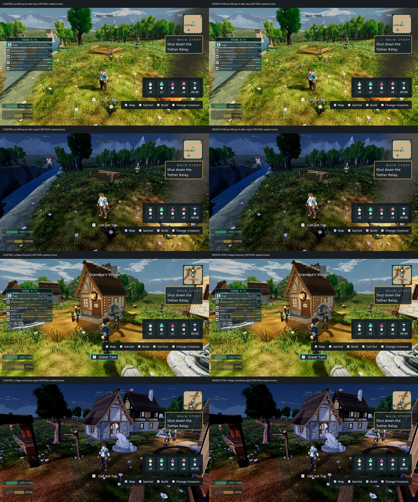

# Shared timber filtering — X04 / V-MA-1 (Doss)

The current Doss capture reproduced noisy, speckled deck and rail surfaces,
not the audit's older blank-white appearance. The perch's collapsed and repaired
shapes already read distinctly. A dark recipe tint hid some noise but failed
independent review because it lost board detail at night; it is not included.

The actual correction enables mipmaps for the existing Medieval Village kit's
WoodTrim base-colour, normal and roughness textures. These are three import
property changes. All source PNGs are byte-identical; no retint, geometry,
collider, repair logic, inventory, reward or placement changes are included.

## Cause and scope

All three 2048×2048 textures previously imported without mip levels. The kit's
57 referencing glTF models already request linear magnification and trilinear
mipmap minification (171 texture bindings). At the production camera the missing
levels produced fine speckling instead of broad board faces. A paired diagnostic
with mipmaps removed that pattern without darkening the timber. Disabling normal
mapping alone retained the noisy texture and was not selected.

This is a shared material-family correction, not a perch-specific override.
Buildings, gates, bridges, interiors, relay and Cloudreach timber also reference
these sheets. Nine direct world-script users were identified in source review.
Some finished build pieces discard their roughness map; their benefit comes from
the other maps. Imported samplers, texture pixels and authored palettes remain
unchanged. This does not add anisotropy or correct stretched UVs.

## Engine evidence

Baseline commit `555c30aff`; current GitHub main `1ba253eb0` is integrated and was
re-fetched after captures. Godot 4.7 `5b4e0cb0f`, Compatibility/OpenGL 3.3,
GTX 1060 3GB, driver 560.94. Every retained PNG header is **1920×1080**.

- Baseline: 19 frames from the ordinary-input Doss walk and repair. The game
  consumed one wood and fiber and set its two Doss flags; repaired metadata was
  true. The approach needed five unstick attempts and one collision recovery.
  This is evidence of an existing route limitation, not a traversal pass.
- Rejected dark tint: 21 frames, including eight paired day/night perch views.
- Filtering diagnosis: 33 frames, including twenty control/tint/filter/normal
  comparisons across both repair states and lighting conditions.
- Actual imported candidate: 33 frames, including eight paired perch views and
  twelve paired village shop/workshop/well views. The production path reads the
  three imported textures with **11 mip levels each**. The comparison changes
  only private copies with their mip chains removed; the production frame
  restores each original material override, including recipe-specific colours.
  Six perch surfaces and 1,003 eligible world surfaces are recorded.

All four capture processes exited zero with completed receipts and no script or
renderer error. Existing world placement/interpolation warnings remain. The
serialized editor import rebuilt exactly the three wood textures, exited zero
and produced empty stderr. The final run again completed Doss's ordinary repair
interaction, spending one wood/fiber and receiving the existing reward. No
additional mechanics test suite was added for these import-only edits.

**DRY RUN — does not count as earned-route acceptance.** All runs load the
disclosed synthetic `S07-exit-band3-plus-1wood-1fiber.json.gz` fixture. Only the
baseline walks from its loaded position. Comparisons stage arrival, pin day/night
and swap private material controls; the final run also stages village camera
stands. Production CameraRig, HUD, lighting and scene are retained. These stills
do not establish motion stability, a complete chapter, co-op, audio or Ally
performance. The standalone walker's older header is superseded by the fixture
README's synthetic-save disclosure.

## Review and limits

Independent source review found no blocker: exactly three property changes,
unchanged source pixels, and compatible authored sampler settings. Full mip
chains add approximately one-third to these textures' storage; this is not a
measured total-memory or performance result. Trim bands can blend at extreme
minification, and untested camera distances remain open.

Independent code-blind diagnostic review passed untinted filtering in day/night
and both repair states: speckling removed, board lines retained, wood identity
and night separation preserved. The darker tint failed and is excluded.
The timber still looks cleaner and more uniform than the reference's weathering;
under-deck support and the perch's distant exploration cue remain weak.

Independent code-blind review of all twenty final paired production frames
passes this correction. Perch boards/rails, shop/workshop frames and fences,
and well posts/roof trim lose the noisy pattern while retaining directional
grain, structural edges, wood colour and separation from plaster/stone. Both
lighting conditions and repair states remain readable, with no blocking
regression. Noise on other surfaces, including the nearby bench/barrel, remains
visible in both controls and candidates. Full Bars A/B remain open; this evidence
closes only the sampled material defect.

Native paths/hashes, receipts, camera/material observations, unchanged source
hashes, import identity and exact local reproduction scripts are retained in
[WOOD-MATERIAL-EVIDENCE.json](WOOD-MATERIAL-EVIDENCE.json). The scripts use a
dedicated local profile and serialized renderer lock. PR365 is the handoff;
Claude owns merging. Draft CI is not engine/export verification.

